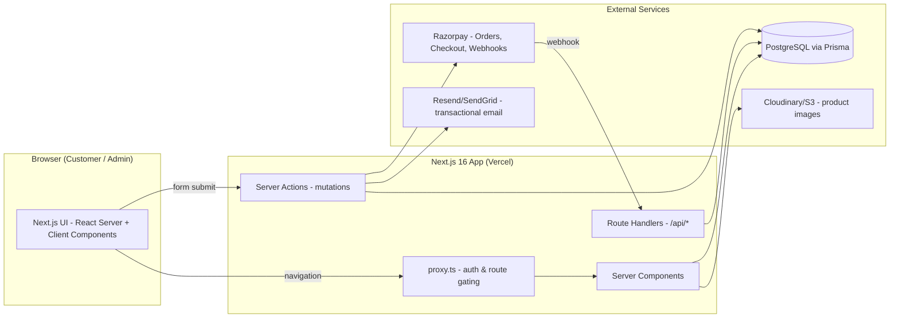
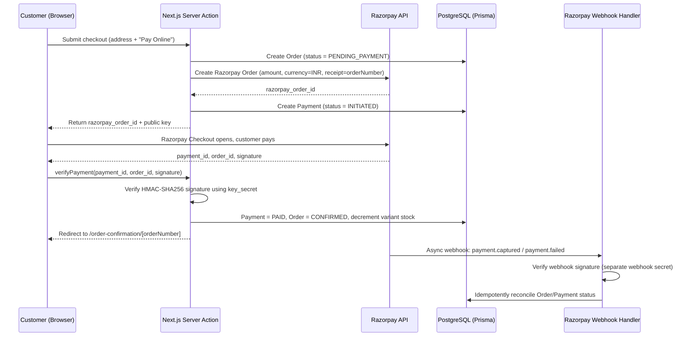

# Product Requirements Document
## Sai Collection — D2C E-Commerce Platform

| | |
|---|---|
| **Version** | 1.0 (Draft for Review) |
| **Date** | August 12, 2026 |
| **Brand** | Sai Collection (Panipat, Haryana) — currently `@saicollectionpnp` on Instagram |
| **Prepared for** | Brand owner / engineering handoff |
| **Status** | Draft — see §22 Open Questions before build starts |

---

## 1. Executive Summary

Sai Collection currently sells through Instagram — DM-based inquiries, manual order-taking, manual payment collection, no structured catalog, no automated checkout. This PRD defines an owned, full-stack e-commerce website that replaces that manual flow with a proper storefront (browse → cart → checkout → pay → track order) and an admin backend to run the operation (catalog, inventory, orders, customers).

**Stack (as specified):**
- **Framework:** Next.js 16 (App Router) for both frontend and backend — no separate API server
- **Language:** TypeScript, end to end
- **ORM / DB:** Prisma + PostgreSQL
- **Payments:** Razorpay (online) + Cash on Delivery (recommended addition, see §4)
- **Hosting:** Vercel (app) + managed Postgres (Neon/Supabase/Railway)

This is a single-vendor D2C storefront, not a marketplace. Scope is split into Phase 1 (MVP — sell products, get paid, fulfill orders) and Phase 2/3 (growth features).

---

## 2. Background & Problem Statement

- **Current state:** Instagram-native brand (bio signals: Panipat-based, possibly shipping wider given the flags in the handle). Discovery happens via Instagram; transactions happen via DM + UPI/COD off-platform.
- **Pain points this causes:**
  - No structured product catalog — buyers scroll a feed to find what they want
  - No cart/checkout — every order is manually typed up by staff
  - No online payment automation — reconciliation is manual
  - No order history, tracking, or repeat-purchase flow for customers
  - Fully dependent on Instagram's reach/algorithm; no owned SEO asset
- **Why now:** A dedicated site turns Instagram into a top-of-funnel channel (bio link, story links, ads) while the website does structured selling, payment, and fulfillment — the standard playbook for Indian D2C fashion brands moving off social commerce.

---

## 3. Goals & Success Metrics

| Goal | Metric | Phase 1 Target (illustrative — confirm with brand) |
|---|---|---|
| Convert Instagram traffic into completed orders | Visit → Order conversion rate | 1.5–2.5% (typical fashion D2C) |
| Reduce manual order-taking effort | % orders placed without staff involvement | >90% |
| Reliable payment collection | Payment success rate (Razorpay) | >95% of initiated payments |
| Fast, low-friction checkout | Cart → Order completion rate | >55% |
| Mobile-first experience (target buyers are on phones) | Mobile Core Web Vitals (LCP) | <2.5s on 4G |
| Repeat purchases | 90-day repeat purchase rate | Track from Day 1, target set after baseline |

---

## 4. Assumptions

Because brand-specific requirements weren't provided, this PRD proceeds on the following assumptions. **Each should be confirmed in §22 before development starts.**

1. Single-brand storefront, not a multi-vendor marketplace.
2. Product type: apparel/garments (men's/women's/kids' wear), with **size** and **color** as the primary variant attributes.
3. **Both Razorpay (online) and Cash on Delivery (COD)** are supported — COD remains high-intent for Tier-2/3 Indian fashion buyers, and excluding it would likely hurt conversion.
4. Domestic (India-only) shipping at launch.
5. Admin users = brand owner + a small internal team (1–3 people), single "Admin" role at launch, extensible later.
6. No native mobile app at launch — a responsive, installable (PWA-capable) web app.
7. English-first UI at launch; Hindi is a strong Phase 2 candidate given the target market.
8. Manual/courier-partner shipping at launch; shipping-aggregator API (Shiprocket/Delhivery/etc.) is Phase 2.
9. Catalog size: small-to-medium (tens to low hundreds of SKUs) at launch.
10. Razorpay live mode requires business KYC (PAN, GST if applicable, bank account) — this is a business prerequisite, not a technical one, but it blocks going live.

---

## 5. Out of Scope (Phase 1)

- Multi-vendor marketplace functionality
- International shipping / multi-currency
- Native iOS/Android apps
- Subscriptions or recurring billing
- Live chat / AI chatbot (candidate for Phase 3, given WhatsApp-native customer base)
- Loyalty points / referral programs
- Advanced personalization / recommendation engine

---

## 6. User Personas

| Persona | Description | Key need |
|---|---|---|
| **Shopper (primary)** | Discovers brand via Instagram/ads, browses on mobile, price- and trust-sensitive | Fast browsing, clear pricing, trustworthy checkout, COD option |
| **Returning Customer** | Has ordered before | Quick reorder, saved addresses, order tracking |
| **Store Admin** | Brand owner/staff managing the shop | Simple product upload, clear order queue, no dev help needed for daily ops |
| **Guest Checkout User** | Wants to buy without creating an account | Minimal-friction guest checkout with option to save details post-purchase |

---

## 7. Information Architecture / Sitemap

```
/                              Home
/products                      All products (PLP)
/products/[slug]                Product detail (PDP)
/categories/[slug]              Category-filtered PLP
/search?q=                      Search results
/cart                           Cart
/checkout                       Address → Shipping → Payment
/order-confirmation/[orderNo]   Post-payment confirmation
/account                        Account overview
/account/orders                 Order history
/account/orders/[orderNo]       Order detail / tracking
/account/addresses               Saved addresses
/account/wishlist                Wishlist
/login, /register                Auth
/about, /contact                 Brand pages
/policies/shipping                Shipping policy
/policies/returns                 Return/exchange policy
/policies/privacy, /policies/terms  Legal

/admin                          Dashboard (role-gated)
/admin/products                 Catalog management
/admin/orders                   Order management
/admin/customers                Customer list
/admin/coupons                  Discount codes
/admin/settings                 Store settings, banners
```

---

## 8. Functional Requirements — Storefront

Priority: **P0** = required for launch, **P1** = important, near-launch, **P2** = Phase 2+.

### 8.1 Home Page (P0)
- Hero/banner (admin-editable), featured categories, featured/new-arrival products, brand story snippet.

### 8.2 Product Listing Page — PLP (P0)
- Grid view with product image, name, price, "from ₹X" for variant pricing.
- Filters: category, size, color, price range.
- Sort: newest, price low–high/high–low, popularity.
- Pagination or infinite scroll.
- Out-of-stock indication.

### 8.3 Product Detail Page — PDP (P0)
- Image gallery (zoom on desktop, swipe on mobile).
- Size/color variant selector with live stock/price update.
- Add to Cart / Buy Now.
- Description, fabric/material details, size chart.
- Related products.
- Reviews & ratings display (P2 for submission, P1 to just display if seeded).

### 8.4 Search (P1)
- Basic text search across product name/description/category (Postgres `ILIKE`/trigram or `tsvector` full-text search — no external search service needed at this scale).

### 8.5 Cart (P0)
- Add/update/remove items, quantity change, live subtotal.
- Persisted cart: DB-backed for logged-in users, cookie/session-based for guests, merged on login.
- Coupon code entry (P1).

### 8.6 Checkout & Payment (P0)
- Guest checkout allowed (P0); account creation optional/post-purchase prompt.
- Address form with pincode-based city/state auto-fill (India Post pincode API or a static dataset).
- Shipping fee calculation (flat rate or slab-based at launch; courier-API rate-shopping is Phase 2).
- Payment method selection: **Razorpay (Cards/UPI/Netbanking/Wallets via Razorpay Checkout)** or **COD**.
- Order summary + place order.
- Order confirmation page + email.

### 8.7 User Accounts (P0)
- Register/login via **Phone OTP** (recommended primary — matches how this buyer segment already transacts) and/or Email+Password; Google OAuth optional (P1).
- Profile management, saved addresses.

### 8.8 Order History & Tracking (P0)
- List of past orders with status.
- Order detail: items, address, payment status, shipment status/tracking number (manually entered by admin at launch).

### 8.9 Wishlist (P1)
- Add/remove products, view saved list, move to cart.

### 8.10 Reviews & Ratings (P2)
- Verified-purchase reviews, admin moderation before publish.

### 8.11 Static/Legal Pages (P0)
- About, Contact, Shipping Policy, Returns/Exchange Policy, Privacy Policy, Terms — **required by Razorpay for live activation**, not optional.

### 8.12 Notifications (P0 email, P2 WhatsApp/SMS)
- Transactional email: order confirmed, shipped, delivered, payment failed.
- WhatsApp/SMS order updates — natural fit given the brand's Instagram/WhatsApp-native customer habits; Phase 2.

---

## 9. Functional Requirements — Admin Panel

### 9.1 Admin Auth (P0)
- Separate `/admin` route group, gated by `role = ADMIN` (or `STAFF`), enforced in `proxy.ts` (Next.js 16's replacement for `middleware.ts`) and re-checked in every Server Action.

### 9.2 Dashboard (P1)
- Today/week/month sales, order count by status, low-stock alerts.

### 9.3 Product & Catalog Management (P0)
- CRUD for products, variants (size/color/price/stock), images (upload to Cloudinary/S3), categories.
- Bulk stock update (P1, e.g. CSV import).

### 9.4 Inventory Management (P0)
- Per-variant stock count, auto-decrement on paid order, low-stock threshold alert.

### 9.5 Order Management (P0)
- Order queue by status, status update (Confirmed → Processing → Shipped → Delivered), tracking number entry, invoice PDF generation (P1).

### 9.6 Customer Management (P1)
- Customer list, order history per customer, basic search.

### 9.7 Discounts / Coupons (P1)
- Percentage or flat discount codes, min order value, usage limits, expiry.

### 9.8 CMS — Banners & Homepage (P1)
- Admin-editable hero banner, featured collections, without needing a code deploy.

### 9.9 Reports & Export (P2)
- Sales report, CSV export for accounting/GST filing.

---

## 10. Technical Architecture

### 10.1 Stack Summary

| Layer | Choice | Notes |
|---|---|---|
| Framework | Next.js 16 (App Router) | Frontend + backend in one app — Route Handlers + Server Actions replace a separate API server |
| Language | TypeScript | Strict mode on |
| Bundler | Turbopack | Default in Next.js 16 (stable) |
| ORM | Prisma | Type-safe DB access, migrations |
| Database | PostgreSQL | Managed (Neon / Supabase / Railway) |
| Auth | Auth.js (NextAuth v5) | Phone OTP + Email/Password (+ Google, optional) |
| Payments | Razorpay | Orders API + Checkout + Webhooks |
| Styling | Tailwind CSS | Utility-first, fast to ship |
| Media | Cloudinary or S3 + `next/image` | Product image storage & optimization |
| Email | Resend or SendGrid | Transactional email |
| Hosting | Vercel | Native Next.js support, edge network |
| Validation | Zod | Shared schema validation client + server |

### 10.2 High-Level Architecture



### 10.3 Next.js 16-Specific Decisions

- **Rendering model — Cache Components:** Adopt the `"use cache"` directive selectively. PLP/PDP pages are cached and revalidated via `revalidateTag()` when a product/stock changes in the admin panel; cart, checkout, and account pages are fully dynamic (uncached) by default, which is Next.js 16's out-of-the-box behavior.
- **`proxy.ts`** (replaces `middleware.ts`): used for session checks and gating `/admin/*` and `/account/*` routes before they render.
- **Server Actions** handle all mutations (add to cart, place order, admin CRUD) — no separate REST layer needed for these.
- **Route Handlers** (`app/api/.../route.ts`) are reserved for cases that need a true HTTP endpoint: the Razorpay webhook (must be a raw POST endpoint) and NextAuth's callback routes.
- **Turbopack** is the default bundler — faster local dev/build, no config needed.
- **React 19.2 features** available via Next 16 (View Transitions for page/cart transitions, `useEffectEvent`) can be used to make the storefront feel more app-like without adopting a separate SPA framework.

### 10.4 Rendering Strategy by Route

| Route | Strategy | Reason |
|---|---|---|
| `/`, `/products`, `/products/[slug]` | Cached (`"use cache"`) + tag-based revalidation | High traffic, changes infrequently, needs to be fast |
| `/cart`, `/checkout` | Dynamic, no cache | User- and session-specific |
| `/account/*` | Dynamic, no cache, auth-gated | Private data |
| `/admin/*` | Dynamic, no cache, auth-gated | Private, always-fresh data |
| `/api/webhooks/razorpay` | Route Handler, no cache | Must process live webhook payloads |

### 10.5 Auth Strategy

- **Auth.js (NextAuth v5)** with:
  - Phone + OTP (via an SMS provider, e.g. MSG91/Twilio) as the primary customer login — matches how this audience already verifies identity for COD orders.
  - Email/Password as a fallback.
  - Google OAuth (P1, reduces friction for some users).
- Admin/staff accounts: Email/Password only, `role` field checked in `proxy.ts` and re-verified inside every admin Server Action (never trust the client).

### 10.6 Suggested Project Structure

```
sai-collection/
├── app/
│   ├── (storefront)/
│   │   ├── page.tsx
│   │   ├── products/
│   │   │   ├── page.tsx
│   │   │   └── [slug]/page.tsx
│   │   ├── categories/[slug]/page.tsx
│   │   ├── search/page.tsx
│   │   ├── cart/page.tsx
│   │   ├── checkout/page.tsx
│   │   ├── order-confirmation/[orderNumber]/page.tsx
│   │   ├── account/
│   │   │   ├── page.tsx
│   │   │   ├── orders/page.tsx
│   │   │   ├── orders/[orderNumber]/page.tsx
│   │   │   ├── addresses/page.tsx
│   │   │   └── wishlist/page.tsx
│   │   └── layout.tsx
│   ├── admin/
│   │   ├── layout.tsx
│   │   ├── page.tsx
│   │   ├── products/
│   │   ├── orders/
│   │   ├── customers/
│   │   └── coupons/
│   ├── api/
│   │   ├── webhooks/razorpay/route.ts
│   │   └── auth/[...nextauth]/route.ts
│   └── layout.tsx
├── actions/
│   ├── cart.ts
│   ├── checkout.ts
│   ├── product.ts
│   ├── wishlist.ts
│   └── admin/
│       ├── products.ts
│       └── orders.ts
├── lib/
│   ├── prisma.ts
│   ├── razorpay.ts
│   ├── auth.ts
│   └── validations/          # Zod schemas
├── prisma/
│   ├── schema.prisma
│   └── seed.ts
├── components/
│   ├── storefront/
│   └── admin/
├── proxy.ts                   # Next.js 16 route gating (replaces middleware.ts)
└── .env
```

---

## 11. Database Schema (Prisma)

```prisma
generator client {
  provider = "prisma-client-js"
}

datasource db {
  provider = "postgresql"
  url      = env("DATABASE_URL")
}

enum Role {
  CUSTOMER
  ADMIN
  STAFF
}

enum OrderStatus {
  PENDING_PAYMENT
  CONFIRMED
  PROCESSING
  SHIPPED
  DELIVERED
  CANCELLED
  RETURN_REQUESTED
  RETURNED
  REFUNDED
}

enum PaymentStatus {
  INITIATED
  PAID
  FAILED
  REFUNDED
  PARTIALLY_REFUNDED
}

enum PaymentMethod {
  RAZORPAY
  COD
}

model User {
  id           String     @id @default(cuid())
  name         String?
  email        String?    @unique
  phone        String?    @unique
  passwordHash String?
  role         Role       @default(CUSTOMER)
  image        String?
  addresses    Address[]
  orders       Order[]
  cart         Cart?
  wishlist     Wishlist?
  reviews      Review[]
  createdAt    DateTime   @default(now())
  updatedAt    DateTime   @updatedAt
}

model Address {
  id        String   @id @default(cuid())
  user      User     @relation(fields: [userId], references: [id])
  userId    String
  fullName  String
  phone     String
  line1     String
  line2     String?
  city      String
  state     String
  pincode   String
  country   String   @default("India")
  isDefault Boolean  @default(false)
  createdAt DateTime @default(now())
}

model Category {
  id       String     @id @default(cuid())
  name     String
  slug     String     @unique
  parentId String?
  parent   Category?  @relation("CategoryTree", fields: [parentId], references: [id])
  children Category[] @relation("CategoryTree")
  products Product[]
  imageUrl String?
}

model Product {
  id          String           @id @default(cuid())
  name        String
  slug        String           @unique
  description String
  categoryId  String
  category    Category         @relation(fields: [categoryId], references: [id])
  basePrice   Int              // stored in paise
  isActive    Boolean          @default(true)
  variants    ProductVariant[]
  images      ProductImage[]
  reviews     Review[]
  createdAt   DateTime         @default(now())
  updatedAt   DateTime         @updatedAt

  @@index([categoryId])
}

model ProductVariant {
  id         String      @id @default(cuid())
  product    Product     @relation(fields: [productId], references: [id])
  productId  String
  size       String?
  color      String?
  sku        String      @unique
  price      Int         // paise — overrides basePrice when set
  stock      Int         @default(0)
  cartItems  CartItem[]
  orderItems OrderItem[]

  @@unique([productId, size, color])
}

model ProductImage {
  id        String  @id @default(cuid())
  product   Product @relation(fields: [productId], references: [id])
  productId String
  url       String
  altText   String?
  position  Int     @default(0)
}

model Cart {
  id        String     @id @default(cuid())
  user      User?      @relation(fields: [userId], references: [id])
  userId    String?    @unique
  sessionId String?    @unique   // guest cart key (cookie)
  items     CartItem[]
  updatedAt DateTime   @updatedAt
}

model CartItem {
  id        String         @id @default(cuid())
  cart      Cart           @relation(fields: [cartId], references: [id])
  cartId    String
  variant   ProductVariant @relation(fields: [variantId], references: [id])
  variantId String
  quantity  Int            @default(1)

  @@unique([cartId, variantId])
}

model Order {
  id            String        @id @default(cuid())
  orderNumber   String        @unique
  user          User?         @relation(fields: [userId], references: [id])
  userId        String?
  items         OrderItem[]
  address       Json          // snapshot at time of order
  subtotal      Int
  shippingFee   Int           @default(0)
  discount      Int           @default(0)
  total         Int
  status        OrderStatus   @default(PENDING_PAYMENT)
  paymentMethod PaymentMethod
  payment       Payment?
  couponCode    String?
  createdAt     DateTime      @default(now())
  updatedAt     DateTime      @updatedAt
}

model OrderItem {
  id        String         @id @default(cuid())
  order     Order          @relation(fields: [orderId], references: [id])
  orderId   String
  variant   ProductVariant @relation(fields: [variantId], references: [id])
  variantId String
  quantity  Int
  price     Int            // price snapshot at purchase time
}

model Payment {
  id                String        @id @default(cuid())
  order             Order         @relation(fields: [orderId], references: [id])
  orderId           String        @unique
  razorpayOrderId   String?       @unique
  razorpayPaymentId String?       @unique
  razorpaySignature String?
  amount            Int
  status            PaymentStatus @default(INITIATED)
  method            PaymentMethod
  rawWebhookPayload Json?
  createdAt         DateTime      @default(now())
  updatedAt         DateTime      @updatedAt
}

model Coupon {
  id            String    @id @default(cuid())
  code          String    @unique
  type          String    // "PERCENT" | "FLAT"
  value         Int
  minOrderValue Int?
  maxUses       Int?
  usedCount     Int       @default(0)
  expiresAt     DateTime?
  isActive      Boolean   @default(true)
}

model Review {
  id         String   @id @default(cuid())
  product    Product  @relation(fields: [productId], references: [id])
  productId  String
  user       User     @relation(fields: [userId], references: [id])
  userId     String
  rating     Int
  comment    String?
  isApproved Boolean  @default(false)
  createdAt  DateTime @default(now())
}

model Wishlist {
  id     String         @id @default(cuid())
  user   User           @relation(fields: [userId], references: [id])
  userId String         @unique
  items  WishlistItem[]
}

model WishlistItem {
  id         String   @id @default(cuid())
  wishlist   Wishlist @relation(fields: [wishlistId], references: [id])
  wishlistId String
  productId  String

  @@unique([wishlistId, productId])
}
```

**Note:** Money fields are stored as integers in **paise** (₹1 = 100), which matches the unit Razorpay's API expects and avoids floating-point rounding issues.

---

## 12. API & Server Actions Design

| Layer | Path | Purpose | Auth |
|---|---|---|---|
| Server Component (data read) | `app/(storefront)/products/page.tsx` | List products (cached) | Public |
| Server Component | `app/(storefront)/products/[slug]/page.tsx` | Product detail (cached) | Public |
| Server Action | `actions/cart.ts → addToCart()` | Add/update cart item | Public (session-based) |
| Server Action | `actions/checkout.ts → createOrder()` | Create Order + Razorpay Order | Public (session-based) |
| Server Action | `actions/checkout.ts → verifyPayment()` | Verify Razorpay signature, confirm order | Public (session-based) |
| Route Handler | `app/api/webhooks/razorpay/route.ts` | Receive & verify Razorpay webhooks | Signed request (Razorpay secret) |
| Route Handler | `app/api/auth/[...nextauth]/route.ts` | Auth.js session handling | N/A |
| Server Action | `actions/admin/products.ts` | Product/variant CRUD | Admin/Staff only |
| Server Action | `actions/admin/orders.ts` | Update order status, tracking | Admin/Staff only |
| Server Action | `actions/wishlist.ts` | Add/remove wishlist items | Logged-in user |

All Server Actions validate input with a shared **Zod** schema and re-check authorization server-side, regardless of what the client sends.

---

## 13. Payment Flow — Razorpay Integration

### 13.1 Online Payment (Razorpay Checkout)



**Why both client-side verification and a webhook:** the client-side signature check confirms payment fast enough to redirect the user immediately, but it can be skipped if the browser closes mid-flow. The webhook is the **source of truth** — it reconciles state even if the customer never returns to the site after paying.

**Signature verification (Server Action / Route Handler):**

```typescript
import crypto from "crypto";

function verifyPaymentSignature(
  razorpayOrderId: string,
  razorpayPaymentId: string,
  signature: string
): boolean {
  const payload = `${razorpayOrderId}|${razorpayPaymentId}`;
  const expected = crypto
    .createHmac("sha256", process.env.RAZORPAY_KEY_SECRET!)
    .update(payload)
    .digest("hex");
  return expected === signature;
}
```

**Webhook signature verification (Route Handler):**

```typescript
function verifyWebhookSignature(rawBody: string, signature: string): boolean {
  const expected = crypto
    .createHmac("sha256", process.env.RAZORPAY_WEBHOOK_SECRET!)
    .update(rawBody)
    .digest("hex");
  return expected === signature;
}
```

Webhook events to subscribe to: `payment.captured`, `payment.failed`, `order.paid`, `refund.processed`.

### 13.2 Cash on Delivery (COD)

- Order created directly with `paymentMethod = COD`, `status = CONFIRMED` (no Razorpay call).
- Optional: OTP-verify the phone number at checkout to reduce fake/prank COD orders — a common practice for Indian D2C brands.

### 13.3 Refunds

- Triggered by admin from the order detail screen (e.g. for cancellations/returns).
- Calls Razorpay's Refunds API for `RAZORPAY` payments; for `COD`, refund is a manual/bank-transfer process tracked in `Payment.status`.

---

## 14. Order Lifecycle

```
PENDING_PAYMENT → CONFIRMED → PROCESSING → SHIPPED → DELIVERED
                     ↓                                    ↓
                CANCELLED                          RETURN_REQUESTED → RETURNED → REFUNDED

PENDING_PAYMENT → (payment failed) → CANCELLED
```

- `PENDING_PAYMENT`: order created, Razorpay payment not yet confirmed (COD orders skip this state).
- `CONFIRMED`: payment verified (or COD accepted) — triggers confirmation email + stock decrement.
- `PROCESSING` → `SHIPPED` → `DELIVERED`: manually advanced by admin (Phase 1); can be automated via courier-API webhooks in Phase 2.
- `CANCELLED`: before shipment, by customer or admin.
- `RETURN_REQUESTED` → `RETURNED` → `REFUNDED`: post-delivery return flow.

---

## 15. Non-Functional Requirements

| Category | Requirement |
|---|---|
| **Performance** | LCP < 2.5s on 4G for PLP/PDP; use `next/image`, Cache Components for catalog pages, and lazy-load below-the-fold content |
| **Security** | HTTPS everywhere; secrets in environment variables (never client-exposed); Razorpay webhook + payment signatures always verified server-side; Zod validation on every Server Action input; rate-limit OTP requests and login attempts |
| **Scalability** | Indexed queries (category, slug, SKU); current schema comfortably handles low-thousands of SKUs and moderate order volume without additional infra |
| **Accessibility** | WCAG 2.1 AA for core flows (browse, cart, checkout) — semantic HTML, keyboard navigation, alt text on product images |
| **SEO** | Server-rendered product/category pages, `next/metadata` for title/description/OG tags, `sitemap.xml`, `robots.txt`, Product structured data (JSON-LD) for rich snippets |
| **Mobile-first** | Majority of traffic will be mobile (Instagram-driven) — design and test mobile first, desktop second |
| **Browser support** | Latest 2 versions of Chrome, Safari, Edge, Firefox; Chrome for Android is the priority target |
| **Localization** | English at launch; architecture should not block adding Hindi (i18n-ready string structure) in Phase 2 |

---

## 16. Analytics & Tracking

- **Google Analytics 4** — funnel tracking (view item → add to cart → begin checkout → purchase).
- **Meta Pixel** — since the brand's acquisition channel is Instagram/Meta, pixel-based conversion tracking and retargeting are high-value from day one.
- Server-side order confirmation event (Conversions API) recommended over client-only pixel firing, for accuracy under iOS tracking restrictions.

---

## 17. Notifications & Communications

| Trigger | Channel (Phase 1) | Channel (Phase 2) |
|---|---|---|
| Order confirmed | Email | + SMS/WhatsApp |
| Payment failed | Email | + SMS |
| Order shipped (+ tracking) | Email | + WhatsApp |
| Order delivered | Email | + WhatsApp |
| Abandoned cart | — | Email/WhatsApp reminder (Phase 2) |

WhatsApp Business API (via Gupshup/MSG91/Meta directly) is a natural fit given the brand's existing WhatsApp/Instagram-native customer relationship, but adds vendor onboarding overhead — recommended for Phase 2, not launch.

---

## 18. Third-Party Services Summary

| Service | Purpose | Notes |
|---|---|---|
| Razorpay | Payment gateway | Requires business KYC for live mode |
| Neon / Supabase / Railway | Managed PostgreSQL | Pick based on budget; Neon has a generous free tier for MVP |
| Cloudinary or AWS S3 | Product image storage & transforms | Cloudinary is simpler to start with (built-in image optimization) |
| Resend or SendGrid | Transactional email | Resend has simpler DX for Next.js apps |
| Vercel | Hosting | First-class Next.js support |
| Google Analytics 4 + Meta Pixel | Analytics/ads tracking | Free |
| MSG91 / Twilio (Phase 1, for OTP) | SMS OTP for login/checkout | Needed if Phone OTP auth is adopted |
| Shiprocket / Delhivery (Phase 2) | Shipping label + tracking automation | Not required for MVP |

---

## 19. Environment Variables

```bash
# Database
DATABASE_URL=

# Auth.js
NEXTAUTH_URL=
NEXTAUTH_SECRET=
GOOGLE_CLIENT_ID=
GOOGLE_CLIENT_SECRET=

# Razorpay
RAZORPAY_KEY_ID=
RAZORPAY_KEY_SECRET=
RAZORPAY_WEBHOOK_SECRET=
NEXT_PUBLIC_RAZORPAY_KEY_ID=

# Media
CLOUDINARY_CLOUD_NAME=
CLOUDINARY_API_KEY=
CLOUDINARY_API_SECRET=

# Email
RESEND_API_KEY=
EMAIL_FROM=

# SMS/OTP (if Phone OTP auth adopted)
SMS_PROVIDER_API_KEY=

# Analytics
NEXT_PUBLIC_GA4_ID=
NEXT_PUBLIC_META_PIXEL_ID=
```

---

## 20. Phased Roadmap

| Phase | Scope | Rough effort (solo/small dev) |
|---|---|---|
| **Phase 0 — Setup** | Repo, Next.js 16 + TS + Tailwind scaffold, Prisma schema + migrations, Vercel + DB provisioning, Auth.js wired up | 3–5 days |
| **Phase 1 — MVP** | Full catalog (PLP/PDP), cart, checkout with Razorpay + COD, order confirmation, account + order history, admin: product CRUD + order management, transactional email, legal pages | 4–6 weeks |
| **Phase 2** | Coupons, wishlist, reviews, Hindi i18n, WhatsApp/SMS notifications, abandoned cart flow, dashboard analytics, CSV export | 3–4 weeks |
| **Phase 3** | Shipping-aggregator integration (auto tracking), multi-admin roles, referral/loyalty, chatbot/WhatsApp commerce | Ongoing |

---

## 21. Risks & Mitigations

| Risk | Impact | Mitigation |
|---|---|---|
| Razorpay live-mode KYC delays (PAN/GST/bank verification) | Blocks going live with online payments | Start KYC in parallel with development, not after; ship with COD-only if needed as interim |
| High COD return/refusal rate (common in Indian fashion e-commerce) | Revenue leakage, wasted shipping | Consider phone-OTP verification at COD checkout; track COD RTO rate from day one |
| Low initial catalog/SEO authority vs. established players | Slow organic traffic growth | Lean on Instagram-to-site funnel + paid social initially, invest in SEO content over time |
| Solo/small team maintaining both storefront and admin | Feature creep risk | Strict Phase 1 scope discipline (this document); resist adding P2 items before MVP ships |
| Webhook missed/delayed (Razorpay-side outage) | Payment shows as pending though it succeeded | Reconciliation job: periodically poll Razorpay for any `INITIATED` payments older than X minutes |

---

## 22. Open Questions for the Brand

These assumptions (§4) directly shape scope and should be confirmed before development starts:

1. Exact product categories (Men/Women/Kids? Ethnic/Western? Any existing SKU list?)
2. Is COD required, or is online-only acceptable?
3. Is Hindi UI needed at launch, or is Phase 2 timing fine?
4. Does the brand have GST registration / business PAN ready for Razorpay activation?
5. Preferred shipping/courier partner, and roughly what shipping fee structure (flat/free-above-X/slab-based)?
6. Return/exchange policy specifics (window, condition, who bears return shipping)?
7. Approximate current/target catalog size?
8. Any existing product photography, or does that need to be planned as part of the project?
9. Target launch date/budget constraints that should shape the Phase 1 cut line?

---

## 23. Appendix — Glossary

| Term | Meaning |
|---|---|
| PLP | Product Listing Page |
| PDP | Product Detail Page |
| COD | Cash on Delivery |
| RTO | Return to Origin (failed COD delivery/return) |
| ISR | Incremental Static Regeneration |
| PPR | Partial Prerendering |
| SKU | Stock Keeping Unit (a specific product variant) |
